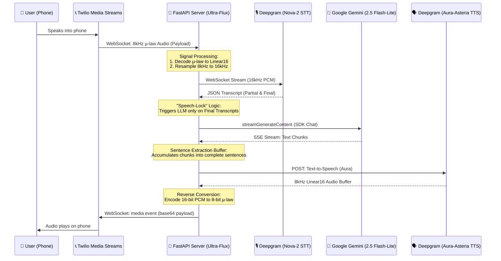

# Architecture Overview: Ultra-Flux Telephony Agent

The Ultra-Flux Telephony Agent is built on a **Dual-Stream Async Pipeline**. It bridges traditional telephony (µ-law audio) with modern AI (PCM audio) with sub-second latency. This architecture enables natural, real-time voice conversations over a standard phone call.

## System Architecture Diagram

## Detailed Component Breakdown

### 1. The Telephony Bridge (Twilio Media Streams)
*   **The Challenge**: Telephony audio is "lossy"—it uses 8kHz µ-law encoding (G.711).
*   **The Solution**: We open a persistent bidirectional WebSocket between Twilio and our FastAPI server. Audio is streamed back and forth in real-time, completely bypassing traditional call-and-response REST limits.

### 2. Signal Processing Layer (Audioop)
*   **Decoding**: Incoming 8-bit µ-law chunks from Twilio are converted into 16-bit PCM for AI processing.
*   **Resampling**: Most AI models (like Deepgram STT) require 16kHz audio. We use Python's `audioop.ratecv` to upsample the 8kHz phone audio to 16kHz on the fly with zero perceived lag.

### 3. The STT Engine (Deepgram Nova-2)
*   **Real-time Streaming**: Audio is streamed continuously to Deepgram over a WebSocket.
*   **Endpointing**: We tune the `endpointing` to **300ms**. This allows the agent to detect when the user has finished a thought almost instantly, triggering the LLM without awkward silences.

### 4. The Intelligence Layer (Gemini 2.5 Flash-Lite)
*   **Official SDK Integration**: We use the `google-generativeai` SDK for robust, native streaming and conversation management.
*   **Session-Based Memory**: The agent maintains a `history` buffer of the last 10 turns per call, giving it "short-term memory" to track context (like dates, locations, or previous answers).
*   **Strict Persona & Speech Cleaning**: The system prompt forces concise responses (1-2 sentences). Before sending to TTS, a `deep_clean_speech` function strips out Markdown, code blocks, bullet points, and prevents stuttering on abbreviations (like `e.g.` or `i.e.`).

### 5. The TTS Pipeline (Deepgram Aura)
*   **Persistent HTTP Client**: We use a global `httpx.AsyncClient` to keep the connection to the TTS engine "always hot." This eliminates the 400ms+ TLS handshake delay on every sentence.
*   **Sentence-Based Streaming**: As soon as the LLM finishes generating a single sentence (detected via regex), it is dispatched to the TTS engine immediately. We do not wait for the entire response to finish generating before speaking.

### 6. High-Performance Concurrency (AsyncIO)
*   **Non-Blocking Execution**: `asyncio.create_task` is used for TTS generation and audio dispatching. The LLM continues thinking and streaming subsequent sentences while the first sentence is already playing on the user's phone.
*   **Barge-In Capabilities**: If the user speaks while the agent is talking, the active `llm_task` is cancelled, allowing for natural, human-like interruptions.

## Round-Trip Latency Breakdown

This architecture is optimized for absolute minimum latency, achieving sub-1.5 second responses.

| Step | Component | Latency (ms) | Why it's this fast |
| :--- | :--- | :--- | :--- |
| **1. Audio Ingress** | Twilio ➔ FastAPI | **~50ms** | Minimal WebSocket overhead. |
| **2. STT (Nova-2)** | Deepgram STT | **~150ms** | "Nova-2" model is optimized for sub-second streaming. |
| **3. Endpointing** | STT Silence Detect | **300ms** | Tuned from the default 1s down to 300ms to trigger the LLM faster. |
| **4. LLM TTFT** | Gemini 2.5 Flash-Lite | **~180ms** | Time-To-First-Token is extremely low on the "Lite" architecture. |
| **5. Processing** | Sentence Buffer | **~20ms** | Regex-based splitting happens almost instantly in memory. |
| **6. TTS Engine** | Deepgram Aura | **~400ms** | Using the **Aura-Asteria** model with a persistent HTTP pool (no handshake delay). |
| **7. Audio Egress** | FastAPI ➔ Twilio | **~50ms** | Bidirectional WebSocket stream is already open and "hot." |
| **TOTAL** | **User ➔ AI ➔ User** | **~1.15s** | **Sub-1.5 second conversation speed.** |

*(Note: P99 perceived latency is often lower because the first sentence begins playing while the LLM is still generating the rest of the response.)*
